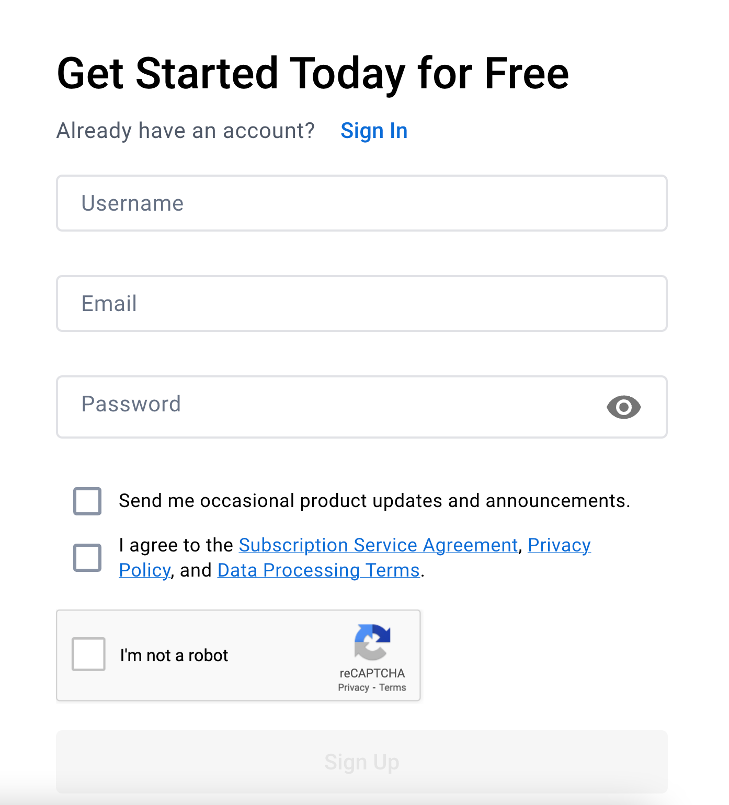

## What Are Registries

On Day 5, you learned about how to create container images. You then learned on Day 6 how to use the container images and run a Docker container based on the container image.

This process works great, but what about if others need to use the container image?

For example, let’s say you’re creating a container image for an application at your job. Whether other people need to access it or you need to deploy the container to an environment other than your `[localhost](http://localhost)` in a repeatable and automated fashion, you’ll somehow need to get the container image into the hands of others.

That’s where container registries come into play.

Container registries are a place where you essentially save your container image.

It’s a universal location where whoever has access can access the container image to use.

There are registries that you can create which are open to the world and registries that are completely private and only those who have proper permissions can access them.

There are a ton of container registries, including registries in public clouds (Azure, AWS, GCP, etc.) and specific tools/platforms that are built for a container registry.

For example, JFrogs Artifactory allows you to have a location to store binaries. One of those “binaries” could be a container image. Then, you could use Xray, which is another feature of Artifactory, to scan the container images (you learned about scanning on Day 9 and will set up scanning on Day 13). With that combination, you have a location to not only store your container images, but to ensure that they’re following proper security practices.

## Setting Up Dockerhub

As mentioned previously, there are a lot of container registries. One of the most popular (and easiest to set up for free) is Dockerhub.

First, go to [https://hub.docker.com/](https://hub.docker.com/). You’ll see a screen similar to the screenshot below.


You can sign up for free on the right side of the page (screenshot below).



Once signed up, you’ll be logged in via the web browser.


Once signed in, create a new repository with the blue **Create repository** button and give it a name of your choosing.


Now that you have a repository created, you can push the container image to the repository that you created on Day 5. To do that, you’ll have to log into Dockerhub on your terminal.

Open up a terminal and run the following command:

```jsx
docker login -u <your-username>
```

You’ll be prompted for your password (the same one you used to sign up for Dockerhub). Once complete, you’ll see the `Login Succeeded` output.


Retrieve the name of the container image you created on Day 5 and tag it.

To tag it, run the following command:

```jsx
docker tag name_of_container_image name_of_registry/name_of_repo:latest
```

Once tagged, push the container image

```jsx
docker push name_of_registry/name_of_repo:latest
```

For example, you can see below that my registry name is `adminturneddevops` and my repo name is `test92`.


Once complete, you’ll see that the container image now exists on Dockerhub.

