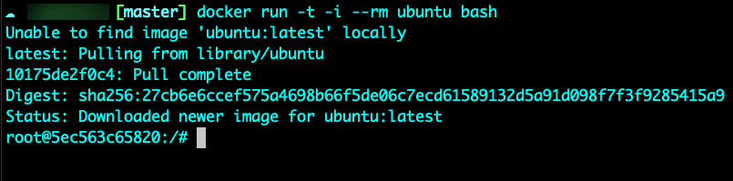

## Container Engine

If you want to run a container, there must be a method of how containers can run that’s running on your current system. Whether that “current system” is your local laptop/desktop, a server, or the cloud. The method of a container having the ability to run (not the method of a container running, which you’ll learn about in the next section) is the container engine.

The container engine allows everything from:

- User requests with a CLI (like the Docker or Podman CLI)
- The ability for images to be cloned and pulled down to a system

and many other pieces to the containerization puzzle.

However, keep in mind, the container engine does not run a container. It just gives the ability to run a container on a system.

If you want to run a container, you need a container runtime.

## Runtime Theory

Container runtimes, well… you guessed it, run containers. What does the actual process look like though?

However, containers aren’t just “magically there” on a server. They’re compromised of several components that make it all work:

- Namespaces
- Cgroups
- Linux Security Modules (LSM)

The runtime is what’s responsible for running the container. Without it, a container wouldn’t exist. The same goes for Kubernetes. If there wasn’t a container runtime in a Kubernetes cluster, the container wouldn’t have the ability to run.

You’ll be diving more into this later on in the series, but at a high level, let’s look at the screenshot below running the `docker run` command.

What is this command doing in the background? How is a container actually running? 

First, as you can see on the screenshot above, a container image is pulled. A container image is built off of a certain standard, which you’ll learn about in an upcoming section.

As the image is being pulled, it’s running all of the commands and entrypoints and anything else that makes up the container image (you’ll learn more about creating a container image another day).

The container image is then saved/mounted on the operating system.

Before the container starts, cgroups and namespaces are used for segregation and resource limits/constraints (see Day 1 for more information about cgroups and namespaces). The kernel is alerted of the container attempting to start, which is when cgroups and namespaces kick into action.

SELinux policies and AppArmor policies are then configured.

And just like that, a container is up and running.

## Docker Runtime

The Docker runtime is the same thing as all other container runtimes. The above explanation of container runtimes in the **Runtime Theory** section goes for every single container runtime.

There are also other container runtimes including:

- Containerd
- Podman
- rkt

and a few others outside of Docker.

The reason why Docekr itself is so popular is because Docker made using containers way easier. Before Docker, we had other runtimes and engines like LXC (Linux Containers). However, Docker made using containers, container engines, and container runtimes way more flexible and consumable. Even thinking about, for example, Docker Desktop. Docker Desktop literally gives you containers right on your local computer.

In short, don’t be confused by the Docker runtime or other runtimes in terms of if they’re different. They aren’t different fundamentally. Of course, the commands that you use with them will be different (and you’ll see that throughout this series).

<aside>
💡 It’s important to note that a container runtime isn’t all that Docker is. There’s also the Docker engine. For example, building a Docker image uses the Open Container Initiative (more on that coming up next) to build the image, but it’s not using the container runtime because the container isn’t running at the time of building an image. Just like the Docker Registry isn’t using the container runtime because the Docker Registry is storing a container image, not running one.

Point being: There are several parts to Docker and it’s not just one blanket component.

</aside>

## Open Container Initiative (OCI)

Remember the standard that is used for container images that was referenced in the Runtime Theory section?

That’s the Open Container Initiative (OCI).

OCI is the standard that containers should meet when being created. It’s the same standard that CRI-O, containerd, Podman, and Docker follow.

It’s essentially a governance around what container formats should look like. How containers are built, how they should run, and how they should be distributed.

Think about it like a checklist of sorts that Docker, Podman, Containerd, etc… follow when building and running containers.

## Dockershim

Before talking about how Kubernetes handles container runtimes, there’s one important component that should be brought up - Dockershim.

Dockershim allowed Kubernetes to use Docker’s container runtime as a Kubernetes container runtime. Now, you’ll typically see either CRI-O or Containerd.

The reason why it was a shim (literally a middle ground/middle man) is because Kubernetes out of the box couldn’t read the Docker container runtime.

Dockershim used to be the standard for running containers in Kubernetes. However, since v1.24 of Kubernetes, it was fully removed.

The reason why it was fully removed is because Dockershim, although it worked, was a middle ground. It was an extra hop/an extra job that Kubernetes had to conduct to run containers. Because of that, CRI-O and other “Kubernetes native” container runtimes are now available out of the box. The “Kubernetes native” way was, and you’ll learn about this in the next section, Container Runtime Interfaces (CRI). This, much like the other Kubernetes plugin models (you’ll learn about those later in this series), allows certain frameworks (plugins) to be a first class citizen in Kubernetes. The Docker runtime was not available for CRI and therefore was removed.

## How Kubernetes Handles Container Runtimes

In the previous section, you learned that the Docker runtime was removed from Kubernetes and replaced with a proper standard - Container Runtime Interface (CRI).

Without a container runtime running on a Kubernetes cluster, Kubernetes wouldn’t know how to do anything with containers. Kubernetes by itself can’t start a container or stop a container. Kubernetes doesn’t even know what a container is. The container runtime runs the container inside of Kubernetes and said runtime talks to the Kubelet (more on Kubelets later) over a Unix socket using the CRI (Container Runtime Interface… more on that later as well) protocol.