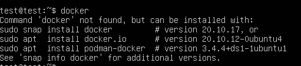

## Installation on Ubuntu (for new server)

For new Ubuntu installations, you can install Docker during the installation of the server.

When you start an Ubuntu installation (the manual way) via the ISO, it’ll look like the below.


On the last screen, once you get passed all of the configuration data, you’ll see an option to install software. Once of those options is Docker.


## Installation on Ubuntu (for existing server)

If you want to install Docker on an existing server, you’ll need to run the installation via the Aptitude package manager..

Notice the below screenshot - by default, Docker is not installed.



You can install Docker by running the following command:

```jsx
apt install docker.io -y
```


Run the following to confirm that Docker was installed properly.

```jsx
docker
```

You’ll see an output similar to the screenshot below.


## Installation on CentOS

If you have a fresh installation of CentOS, Docker will not be installed by default. Per the screenshot below, when you try to run `docker`, it won’t work.


To install Docker, run the following:

```jsx
yum install docker
```


Now when you run `docker`, you’ll see an output similar to the screenshot below.


## Other Linux Distros

For any other Linux distros, the installation process will look the same outside of the package manager that you’re using. For example, Ubuntu used the Aptitude package manager whereas CentOS uses the Yum package manager.

## Installation on Windows Server

For installing containers and Docker on Windows Server, you have a few options.

The first option below, under Roles and Features via Server Manager, you can install the Containers tool which allows you to run Windows Containers on the server.


To install Docker, run the following commands

```jsx
Install-Module -Name DockerMsftProvider -Repository PSGallery -Force
Install-Package -Name docker -ProviderName DockerMsftProvider
```

Restart your server once complete.

```jsx
Restart-Computer
```