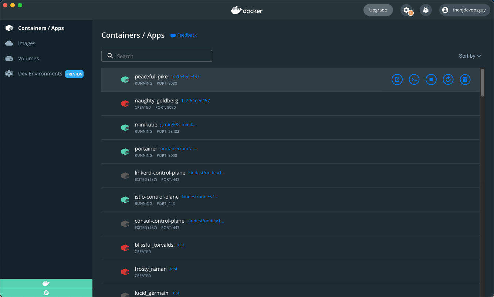

## Why Docker Desktop?

On Day 3, you learned about a few different ways for installing Docker on Linux and Windows. The thing is, you may not want to or need to do that for local development. Maybe you’re just getting started with Docker and containerization as a whole, so you don’t want to worry about creating servers, installing Docker, and managing it all.

If that’s the case, using something like Docker Desktop is a great solution.

Docker Desktop takes the Docker engine and installs it on your local computer. It’s installed like any other piece of software.

Docker Desktop gives you the ability to run Docker containers locally, whether you’re on a Mac, Windows Desktop, or even a Linux distro desktop like Ubuntu.

It’s pretty cool because it makes containers far more accessible. In fact, that’s pretty much the idea that Docker had in general. Before Docker, there were other container engines, but Docker made containers far more accessible and easier to use. With Docker Desktop, they take that same idea and bring it to your `localhost`.

## Installing Docker Desktop

To install Docker Desktop, go to the following URL (you’ll need admin rights to install).

[https://www.docker.com/products/docker-desktop/](https://www.docker.com/products/docker-desktop/)

Choose the installation method for your particular operating system.

Once you go through the download process, you should see the binary downloading.

Once downloaded and installed, you should see the Whale icon running. For example, on a Mac, you’ll see it on your upper taskbar.

## Using Docker Desktop

When you open up Docker Desktop, you’ll see a screen similar to the screenshot below (minus the containers that are running on my machine.

Docker Desktop gives you a lot of management capabilities over:

- Container images
- Containers that are running
- Volumes
- Dev/testing environments

And an overall visual/UI/GUI for container management.

Without Docker Desktop, you can manage containers the same way, but it’s all via the CLI, which is totally fine. Docker Desktop is just nice because it gives you a “user experience” when it comes to containers.

I encourage you to play around with Docker Desktop and get familiar with the user experience as it may come in handy later.

Throughout this series, chances are you’ll never have to open the Docker Desktop GUI again, so there isn’t too much detail that you need in terms of getting through the series. However, if you’re curious, dive in.

## Docker Desktop For Kubernetes

When using Docker Desktop, you can use it for Kubernetes. If you’d prefer to not use Minikube, KinD, or another local method, you can use Docker Desktop.

If you’d prefer to use Minikube or another local method, you can, and you can also manage it via Docker Desktop. For example, below is a screenshot of a few Kubeconfigs I have available.

Docker brings containerization and it also brings a way to interact with and manage Kubernetes clusters both on your local computer and anywhere else (in the cloud for example).