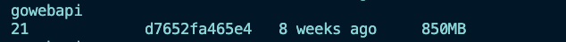
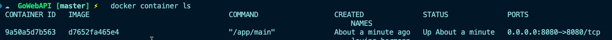
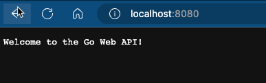

## How Many Ways?

There are a lot of different ways to run containers. You can run them locally, in a service like Azure Container Instance, on various different clouds, and with various different runtimes.

Instead of going through the various methods, let’s go through the key first method of running a container.

Once you know the first method, running containers on other platforms will make sense. It’s more or less all the same once you know the foundation.

## Running Containers

In Day 5, you learned how to create a container image. Let’s now learn how to run that container image.

First, confirm the container image ID

```jsx
docker image ls
```

For the `gowebapi` container image, you’ll see that there’s a container image next to it like in the screenshot below (yours will be different).



```jsx
docker run -p 8080:8080 -tid d7652fa465e4
```

You’ll see an output similar to the below.

```jsx
9a50a5d7b5635b4bc1f62f44342677d4bc528c5831720d8ae153fdca6bb0e5b2
```

Run the `ls` command to see that the container is running.

```jsx
docker container ls
```



If you open up `[localhost](http://localhost)` over port `8080` in a web browser, you’ll see that the application is running.



So, how did this work?

## How Is The Container Running?

First, you use the `run` command from the Docker CLI. This indicates that you want to run a Docker container.

Next, you specified the `-p` flag, which indicates the port. However, you see two ports (they’re the same): `8080:8080`.

The first `8080` indicates the port that you want to reach the application on locally on your computer.

The second `8080` after the colon (`:`) indicates the port that the containerized application is listening on.

Next, you see three flags together: `-tid`.

`t` stands for a TTY console.

`i` stands for interactive, which keeps STDIN open even if you’re not attached (almost like SSH’d into) the container.

`d` stands for detach, which means you’re not running inside of the container on your terminal, but instead, the container is running as a background process.

There are several other flags that are available for the `run` command, which you can find here: [https://docs.docker.com/engine/reference/run/](https://docs.docker.com/engine/reference/run/)