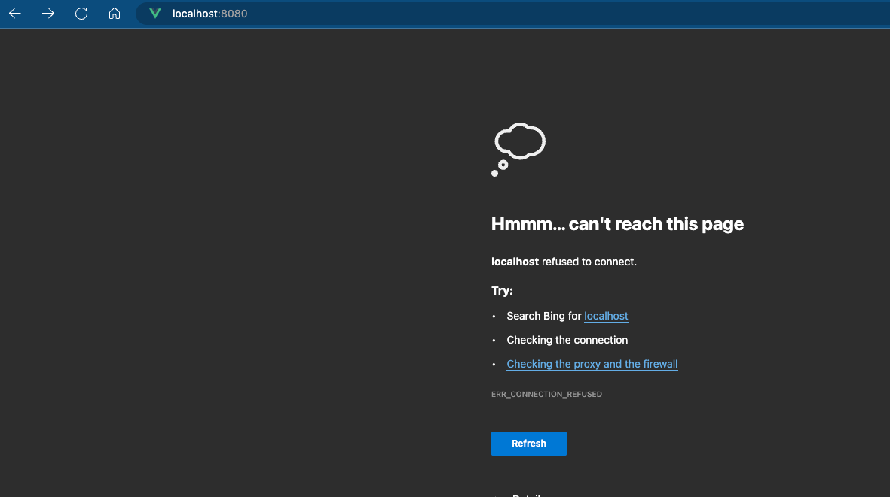

## Docker Networking

First things first - if you’re not already familiar with general IT networking, it’s highly recommended for you to start there before you move on with Day 7.

If you need to get up to speed with Networking, I recommend looking at the CompTIA Network+. You don’t have to get the certification by any means. However, you should have the knowledge.

Pick up a book or a course on Network+. I don’t have any specific recommendations as I haven’t looked into courses/books on this topic in about 10 years, but check out reviews on Amazon or see the reviews on whichever platform you’re using for courses.

I’m sure there’s some stuff on YouTube as well.

With that said, let’s get into Docker Networking.

Docker Networking contains two ports:

- Networking at the host level
- Networking at the container level

Conceptually, and technically, the way that you “use” networking at the host or the container level is the same.

What do I mean by that? Networking is networking.

IP addresses are IP addresses.

Ports are ports.

Firewalls are firewalls.

Routing traffic is routing traffic.

It’s all the same stuff. It’s just a matter of how you’re implementing it.  That’s why when it comes to container networking, it’s not really about learning container networking. It’s about learning networking.

The key difference to remember is that Docker networking adds another layer and you have to look at both the host and the container level.

Let’s think of an example.

Say you’re running an Nginx container that’s listening over port `80`. Port `80` is confirmed, as in, that’s DEFINITELY what the application is listening on. However, let’s say that the host where the Docker container is running doesn’t have port `80` open. It doesn’t matter if the container networking has port `80` open and is listening on port `80`. If the host where the Docker engine is running doesn’t allow inbound on port `80`, no one is going to be able to reach the Nginx application.

## Docker Networking Drivers

Docker uses pluggable drivers (very much like the ability to use Container Networking Interfaces (CNI) in Kubernetes, which you’ll learn about on another day).

Let’s go over each.

1. Bridge is the default network driver. This method is common when running containers in a standalone (like your `localhost`) environment.
2. Host is also used for standalone containers which removes network isolation between container networking and the host.

If you use the hostnetwork mode for a container, that container is not isolated from the hosts network.

3. Overlays connect multiple Docker daemons together and enable Docker Swarm services to communicate (you’ll learn about Swarm on another day).
4. Ipvlan are VLANs for container networking (both ipv4 and ipv6).
5. Macvlan networks allow you to assign a MAC address to a container.
6. None means disabling all networking for a container.

There are also network plugins that you can use to install third-party network plugins.

## Container Networking

When it comes to container networking as you’re getting started on this journey, you’ll definitely want to turn your attention to ports.

Remember in Day 6 when you ran the container?

```jsx
docker run -p 8080:8080 -tid d7652fa465e4
```

Understanding the following is incredibly important.

The first `8080` (before the colon) is the port that the host is listening on. As in, when you access the web server running on that container from, for example, your `localhost`, it’ll be over port `8080`.

The second `8080` (after the colon) is what the container is listening on. As in, that’s the port in the code that’s hardcoded.

For example, let’s take a look at the function in the Go code below.

```jsx
func request1() {
	http.HandleFunc("/", homePage)
	http.HandleFunc("/aboutme", aboutMe)
	http.HandleFunc("/whoami", whoAmI)

	log.Fatal(http.ListenAndServe(":8080", nil))
}
```

Notice how the `ListenAndServe` function is specifying port `8080`? That means that’s the port that the application is listening on.

What happens if, for example, you try to specify another port?

For example, if you ran the following:

```jsx
docker run -p 8080:8081 -tid d7652fa465e4
```

If you try to access the container, you’ll see the following.



Why?

Because that’s not the port that the application is listening on.

## What About Swarm?
We're going to be discussing Swarm on a full day, so don't dive too deep right now (of course, Google around if you're curious). I just wanted to bring it up as it is a part of Docker and overall networking, but it does require a full day.